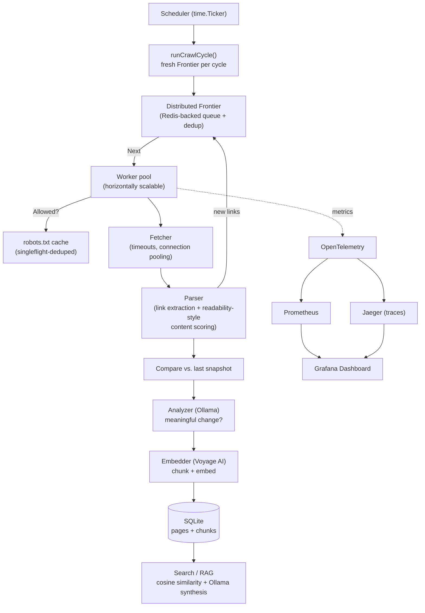

# Argus

**A distributed web crawler that watches the internet change — and lets you ask it questions about what it finds.**

Named for Argus Panoptes, the many-eyed giant of Greek mythology whose one job was to watch everything and miss nothing.

---

## What Argus does

Point Argus at a set of websites — competitor pages, documentation, a knowledge base, anything — and it:

1. **Crawls them properly.** Concurrent, `robots.txt`-compliant, per-host rate-limited, resumable, and built to scale horizontally across machines rather than just threads on one box.
2. **Watches them over time.** Re-crawls on a schedule and uses a local LLM to tell the difference between a *meaningful* change (a price change, a new feature, a policy update) and cosmetic noise (ads, view counters, timestamps).
3. **Makes them queryable by meaning.** Every page is chunked, embedded, and indexed — so instead of grepping through scraped HTML, you can ask a real question in plain English and get back a synthesized, sourced answer.

Argus isn't a scraping script with an LLM bolted on. The crawler underneath is real infrastructure — concurrent by design, politeness-aware, horizontally scalable — the same category of engineering that powers actual search and monitoring products, not a `requests.get()` loop in a notebook.

---

## Why it exists

Most "AI + web scraping" portfolio projects start from a lazy, single-threaded scraper and bolt a chatbot on top. Argus inverts that: the crawler is the hard part, built first and built properly, and the AI layer is a natural extension of data the system was already producing — not the whole point.

---

## Architecture



---

## Tech stack

| Layer | Choice | Why |
|---|---|---|
| **Language** | Go | Concurrency primitives (goroutines, channels, `sync.Cond`) map directly onto the crawling problem |
| **Storage** | SQLite | Real relational DB, zero ops, single file, trivial to inspect |
| **Distributed coordination** | Redis | Shared queue + dedup set across worker processes/machines |
| **Change detection** | Ollama (local LLM) | Free, unlimited, no API costs, runs entirely offline |
| **Embeddings / semantic search** | Voyage AI (`voyage-4-lite`) | Retrieval-optimized, generous free tier |
| **Observability** | OpenTelemetry → Prometheus (metrics) + Jaeger (traces) | Vendor-neutral instrumentation, industry-standard backends |
| **Dashboards** | Grafana | Live view of crawl health, throughput, and detected changes |
| **Deployment** | Docker / docker-compose | One-command local stack, horizontal worker scaling demoed live |

**Total ongoing cost: $0.** Every dependency in this stack is free at the scale Argus runs at — a deliberate constraint, not an accident.

---

## Key engineering decisions

A few choices worth calling out, since they're the parts that took real thought rather than following a tutorial:

- **Termination detection in the crawl frontier.** Knowing when a concurrent crawl is *actually* finished — not just "the queue looks empty right now" — requires tracking in-flight work separately from queued work. Built with a `pending` counter and `sync.Cond`, not a fixed timeout or a guess.
- **`robots.txt` fetches are deduplicated with `singleflight`**, so five workers hitting a new host simultaneously trigger exactly one fetch, not five.
- **Content extraction uses link-density scoring** (a simplified Readability-style algorithm) to find the real article content in a page, discounting nav bars and link-heavy boilerplate rather than naive tag-stripping.
- **The database writer is single-threaded by design** — all writes funnel through one goroutine via channels (`select`-ing across page-writes and chunk-writes), sidestepping SQLite's single-writer limitation entirely rather than fighting it with locks.
- **Re-embedding is change-gated, not blind.** Pages are only re-chunked and re-embedded when a real content change is detected — avoiding wasted API calls and duplicate search index entries on every re-crawl of an unchanged page.
- **Brute-force cosine similarity, deliberately, not a vector database.** At this project's data volume (thousands, not millions, of chunks), a linear scan is faster to build, easier to reason about, and genuinely faster in practice than standing up ANN infrastructure. The upgrade path is known and documented, not needed yet.

---

## Quick start

```bash
# 1. Clone and install dependencies
git clone <your-repo-url>
cd argus
go mod tidy

# 2. Start a local LLM (for change detection + answer synthesis)
ollama pull llama3.2
ollama serve

# 3. Get a free Voyage AI API key (voyageai.com) and set it
export VOYAGE_API_KEY=your-key-here

# 4. Start the full stack (Redis, Prometheus, Grafana, Jaeger)
docker-compose -f deploy/docker-compose.yml up -d

# 5. Run the crawler
go run ./cmd/crawler

# 6. Ask it something
go run ./cmd/search "what changed on their pricing page recently?"
```

Grafana dashboard: `http://localhost:3000` · Prometheus: `http://localhost:9090` · Jaeger: `http://localhost:16686`

---

## Project structure

```
argus/
  cmd/
    crawler/        entry point - scheduler + crawl cycles
    search/          CLI: ask a question, get a sourced answer
  internal/
    frontier/        concurrent URL queue, dedup, politeness, termination detection
    fetcher/         HTTP fetching with timeouts + connection pooling
    parser/          link extraction + readability-style content scoring
    robots/          robots.txt fetching, caching, singleflight dedup
    store/           SQLite persistence, single-writer pattern
    analyzer/        Ollama-backed change detection + answer synthesis
    embedder/        Voyage AI embeddings + text chunking
    search/           cosine similarity + top-K retrieval
    metrics/         OpenTelemetry → Prometheus instrumentation
  deploy/
    docker-compose.yml
    prometheus.yml
```

---

## Roadmap / status

- [x] Concurrent crawler core (Frontier, Fetcher, Parser)
- [x] Politeness (robots.txt, per-host rate limiting, singleflight)
- [x] Persistent storage (SQLite)
- [x] Scheduled re-crawling
- [x] AI change detection (local LLM)
- [x] Semantic search / RAG (Voyage embeddings + Ollama synthesis)
- [x] Metrics (Prometheus)
- [x] Distributed architecture (Redis-backed frontier, horizontal worker scaling)
- [x] Distributed tracing (Jaeger)
- [x] Dashboard (Grafana)
- [x] Containerized deployment (Docker Compose)

---

## License

MIT