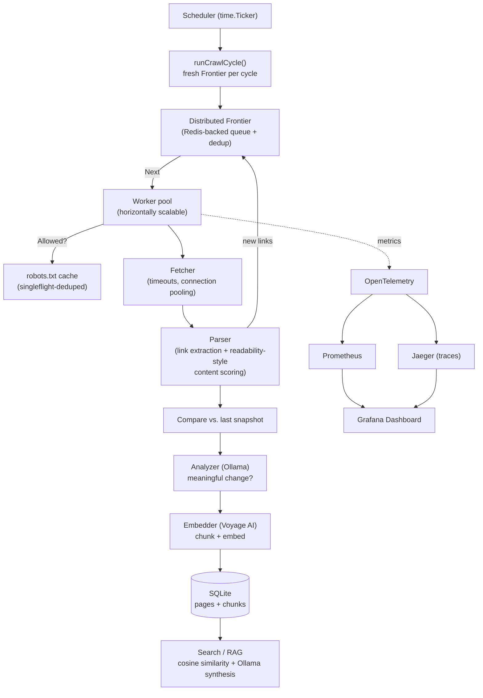

# Argus

**A distributed web crawler that watches the internet change, and lets you ask it questions about what it finds.**

Named after Argus Panoptes, the many-eyed giant from Greek mythology whose whole job was to watch everything and miss nothing.

---

## What it does

Point Argus at a set of websites (competitor pages, docs, a knowledge base, whatever you care about) and it will:

1. **Crawl them properly.** Concurrent, respects `robots.txt`, rate-limited per host, resumable, and built so it can scale across multiple machines instead of just running threads on one box.
2. **Watch them over time.** Re-crawls on a schedule and uses a local LLM to tell apart a real change (a price update, a new feature, a policy change) from noise (ads, view counters, timestamps that update on their own).
3. **Let you query them by meaning.** Every page gets chunked, embedded, and indexed, so instead of digging through scraped HTML you can just ask a question in plain English and get back an answer with sources.

The crawler underneath isn't an afterthought. It's real concurrent infrastructure, built first, that the AI features sit on top of, rather than a scraping script with a chatbot bolted on.

## Why I built it this way

A lot of "AI + scraping" projects start from a single-threaded script that grabs a page and hands it to an LLM. I wanted the crawler itself to be the hard part, something that actually handles concurrency, politeness, and scale correctly, and then let the AI layer be a natural next step on top of data the system was already collecting, rather than the whole point of the project.

## Architecture



## Tech stack

| Layer | Choice | Why |
|---|---|---|
| **Language** | Go | Goroutines, channels, and `sync.Cond` map naturally onto a crawling problem |
| **Storage** | SQLite | Real relational DB, no separate server to run, easy to inspect |
| **Distributed coordination** | Redis | Shared queue and dedup set across worker processes |
| **Change detection** | Ollama (local LLM) | Free, unlimited, runs entirely offline |
| **Embeddings / semantic search** | Voyage AI (`voyage-4-lite`) | Built for retrieval, generous free tier |
| **Observability** | OpenTelemetry, Prometheus, Jaeger | Standard instrumentation, not a homemade metrics endpoint |
| **Dashboards** | Grafana | A live view of crawl health and detected changes |
| **Deployment** | Docker / docker-compose | One command to bring up the whole stack locally |

This whole thing runs for free at the scale it's built for. That was a constraint I set on purpose, not something that happened by luck.

## A few decisions worth explaining

Some parts of this took real thought, so I'll call them out instead of leaving them buried in the code:

- **Knowing when a crawl is actually finished.** An empty queue doesn't mean the crawl is done, since a worker could still be mid-fetch and about to add ten new URLs. Argus tracks in-flight work separately from queued work with a `pending` counter and `sync.Cond`, instead of guessing with a timeout.
- **`robots.txt` fetches are deduplicated.** If five workers hit a new host at the same moment, only one of them actually fetches `robots.txt`; the rest wait for that result instead of all hitting the site at once. Built with `singleflight`.
- **Content extraction scores blocks by link density**, a simplified version of the Readability algorithm browsers use for reader mode. This is what keeps nav bars and related-link sidebars from being mistaken for the actual article text.
- **Only one goroutine ever writes to the database.** Instead of locking around every write, all writes funnel through a single writer that listens on two channels with `select`. Sidesteps SQLite's single-writer limit entirely instead of working around it with mutexes.
- **Pages only get re-embedded when they actually change.** If a re-crawl finds nothing meaningfully different, the existing chunks and embeddings stay as they are. Saves API calls and keeps the search index from filling up with duplicates of the same unchanged content.
- **Similarity search is a plain loop, not a vector database.** At the scale this runs at (thousands of chunks, not millions), comparing everything directly is fast enough and much simpler to reason about than standing up something like FAISS or pgvector. If the data ever grew past that, this is the specific piece I'd swap out.

## Quick start

```bash
# 1. Clone and install dependencies
git clone <your-repo-url>
cd argus
go mod tidy

# 2. Start a local LLM (for change detection + answer synthesis)
ollama pull llama3.2
ollama serve

# 3. Get a free Voyage AI API key (voyageai.com) and set it
export VOYAGE_API_KEY=your-key-here

# 4. Start the supporting stack (Redis, Prometheus, Grafana, Jaeger)
docker-compose -f deploy/docker-compose.yml up -d

# 5. Run the crawler
go run ./cmd/crawler

# 6. Ask it something
go run ./cmd/search "what changed on their pricing page recently?"
```

Grafana: `http://localhost:3000` · Prometheus: `http://localhost:9090` · Jaeger: `http://localhost:16686`

## Project structure

```
argus/
  cmd/
    crawler/        entry point - scheduler + crawl cycles
    search/          CLI: ask a question, get a sourced answer
  internal/
    frontier/        concurrent URL queue, dedup, politeness, termination detection
    fetcher/         HTTP fetching with timeouts and connection pooling
    parser/          link extraction + readability-style content scoring
    robots/          robots.txt fetching, caching, singleflight dedup
    store/           SQLite persistence, single-writer pattern
    analyzer/        Ollama-backed change detection + answer synthesis
    embedder/        Voyage AI embeddings + text chunking
    search/           cosine similarity + top-K retrieval
    metrics/         OpenTelemetry to Prometheus instrumentation
  deploy/
    docker-compose.yml
    prometheus.yml
```

## Roadmap / status

- [x] Concurrent crawler core (Frontier, Fetcher, Parser)
- [x] Politeness (robots.txt, per-host rate limiting, singleflight)
- [x] Persistent storage (SQLite)
- [x] Scheduled re-crawling
- [x] AI change detection (local LLM)
- [x] Semantic search / RAG (Voyage embeddings + Ollama synthesis)
- [x] Metrics (Prometheus)
- [x] Distributed architecture (Redis-backed frontier, horizontal worker scaling)
- [x] Distributed tracing (Jaeger)
- [x] Dashboard (Grafana)
- [x] Containerized deployment (Docker Compose)

## License

MIT